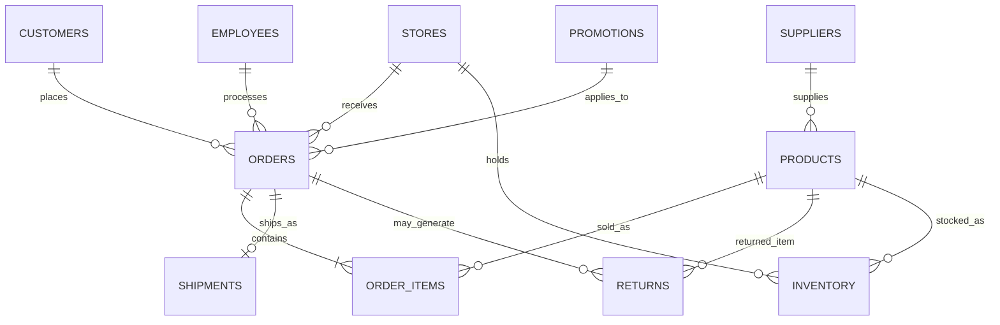

# Entity Relationship Diagram

```mermaid
erDiagram
    CUSTOMERS ||--o{ ORDERS : places
    STORES ||--o{ ORDERS : receives
    EMPLOYEES ||--o{ ORDERS : processes
    PROMOTIONS ||--o{ ORDERS : applies_to
    ORDERS ||--|{ ORDER_ITEMS : contains
    PRODUCTS ||--o{ ORDER_ITEMS : sold_as
    SUPPLIERS ||--o{ PRODUCTS : supplies
    ORDERS ||--o| SHIPMENTS : ships_as
    ORDERS ||--o{ RETURNS : may_generate
    PRODUCTS ||--o{ RETURNS : returned_item
    STORES ||--o{ INVENTORY : holds
    PRODUCTS ||--o{ INVENTORY : stocked_as
```
